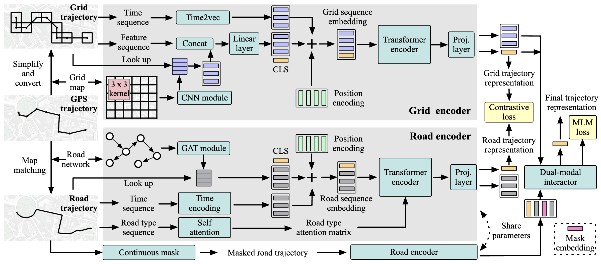

# Grid and Road Expressions Are Complementary for Trajectory Representation Learning

**[KDD2025(August Cycle)]** The pytorch implementation of accepted paper "Grid and Road Expressions Are Complementary for Trajectory Representation Learning"

GREEN is based on Python version 3.10 and PyTorch version 2.0.1. Please make sure you have installed Python, PyTorch correctly. Then you can install other dependencies as follows:

*geographiclib*==2.0

*geohash2*==1.1

*geopy*==2.4.1

*haversine*==2.8.1

*pandas*==2.2.3

*PyYAML*==6.0.2

*scikit_learn*==1.3.0

*scipy*==1.14.1

*Shapely*==2.0.6

*timm*==0.9.8

*torch_geometric*==2.3.1

*torchvision*==0.15.2

*tqdm*==4.66.1

## Framework
<div align=center>

</div>


## Dataset
Due to privacy, we only provide Porto dataset. To get road trajectories, please refer to the [FMM](https://github.com/cyang-kth/fmm).

To use dataset, unzip dataset in directory `./data/porto`, this dataset contains the road trajectory. （Use Git LFS or Download .zip in directory `./data/porto`）

- `./data/porto/rn/...` is the road network data.

- `./data/porto/traj.csv` is the raw trajectory data.

- `./data/porto/traj/*_od.csv` is the trajectory data for similarity.


## Hyper-parameters

The hyper-parameters are in `./config/config.py`. You can modify it according to your needs.

## Pretraining

```
# Chengdu
python main.py --dataset chengdu

# Porto
python main.py --dataset porto 
```
You can set **exp_id** in the `main.py`.

When running the model for the first time, it preprocesses the data to get pretrained time encoding, grid trajectory, road feature, etc, which will take some time, so be patient.


## Downstream Tasks

When run the model for the downstream tasks, set the same **exp_id** in `main_<task>.py` as for pre-training.

### Travel Time Estimation (Fine-tuning)
```
# Chengdu
python main_tte.py --dataset chengdu

# Porto
python main_tte.py --dataset porto 
```

### Trajectory Classification (Fine-tuning)
```
# Chengdu
python main_cls.py --dataset chengdu

# Porto
python main_cls.py --dataset porto 
```

### Most Similar Trajectory Search (No Fine-tuning)
```
# Chengdu
python main_sim.py --dataset chengdu

# Porto
python main_sim.py --dataset porto 
```

### Cite

If you find the paper useful, please cite our paper. ^_^
```
@article{zhou2024grid,
  title={Grid and Road Expressions Are Complementary for Trajectory Representation Learning},
  author={Zhou, Silin and Shang, Shuo and Chen, Lisi and Han, Peng and Jensen, Christian S},
  journal={arXiv preprint arXiv:2411.14768},
  year={2024}
}
```
